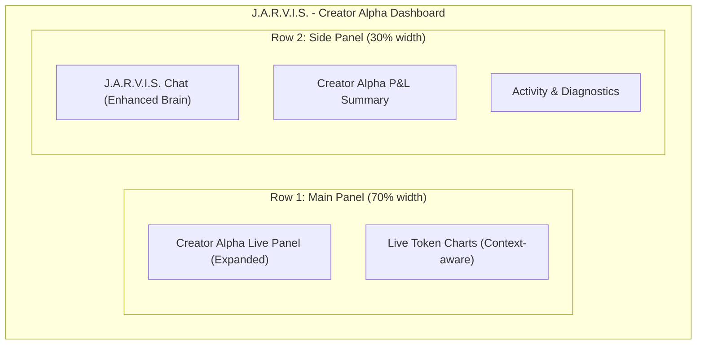

# Dashboard Redesign and AI Brain Enhancement Plan

## 1. Introduction

This document outlines a plan to redesign the J.A.R.V.I.S. dashboard and enhance its AI capabilities. The primary goals are to:

1.  Create a cleaner, more interactive dashboard that focuses exclusively on the **Creator Alpha** strategy.
2.  Replace the current AI brains with a more powerful and specialized set of models for Solana trading.
3.  Provide a clear implementation path for these changes.

## 2. Proposed Dashboard Layout

The new dashboard will be a single, streamlined view that prioritizes the information most relevant to the Creator Alpha strategy. The layout will be more spacious and interactive, making it easier to monitor performance and make decisions.

### 2.1. Layout Diagram

### 2.2. Layout Description

*   **Creator Alpha Live Panel (Expanded):** This will be the main focus of the new dashboard. It will be expanded to show more detail about the `fund/create/graduate` pipeline, including timings, wallet flows, and key events. This will provide a clear, real-time view of the entire alpha-generation process.
*   **Live Token Charts (Context-aware):** This panel will display charts for the tokens currently in the Creator Alpha pipeline. It will be context-aware, automatically switching to the most relevant token when you interact with the live panel.
*   **J.A.R.V.I.S. Chat (Enhanced Brain):** The chat window will remain, but it will be powered by a new, more specialized AI brain focused on Solana trading. This brain will provide more insightful analysis and actionable recommendations.
*   **Creator Alpha P&L Summary:** A dedicated panel will display a concise summary of the Creator Alpha strategy's performance, including win rate, total P&L, and other key metrics.
*   **Activity & Diagnostics:** This panel will combine the most critical information from the current activity feed and diagnostics panels, providing a compact view of important system events and any issues that need attention.

## 3. AI Brain Enhancement

To improve trading logic and decision-making, I propose a two-part enhancement to the AI brain.

### 3.1. New "Main Brain" for Chat

The main chat interface will be driven by a new model with deep expertise in Solana trading, market analysis, and risk management. I recommend we explore models from providers like **Together AI** or **Fireworks AI**, which offer a wide range of open-source and specialized models that can be fine-tuned for our specific needs. A model like **Mixtral 8x22B** could be a powerful starting point.

### 3.2. Replacing the Claude Decision-Maker

For the core `EXIT` or `HOLD` decisions, we need a model that is both fast and highly accurate in its trading logic. While Claude Haiku is fast, a more specialized model could provide better results. I recommend we benchmark a few alternatives, including:

1.  **Llama 3.1 8B:** A powerful and fast open-source model that has shown excellent reasoning capabilities.
2.  **A Fine-Tuned Gemma 2:** We can fine-tune the Gemma 2 model on our own trading data to create a highly specialized and accurate decision-maker.
3.  **A Custom Rules-Based Engine:** For ultimate control and transparency, we can develop a custom, rules-based engine that works in tandem with the AI. This would allow us to encode our own trading knowledge and risk parameters directly into the system.

## 4. Implementation Plan

I will break down the implementation into two main phases:

**Phase 1: Dashboard Redesign**

1.  Create a new layout component in the frontend codebase based on the mockup above.
2.  Modify the `App.tsx` file to use the new layout and component arrangement.
3.  Expand the `CreatorAlphaPanel` component to include the additional details from the `fund/create/graduate` pipeline.
4.  Update the charting component to be context-aware.

**Phase 2: AI Brain Replacement**

1.  Set up accounts with new AI providers (e.g., Together AI, Fireworks AI).
2.  Modify the `run_traderbot.py` script to integrate the new chat and decision-making models.
3.  Benchmark the new models to evaluate their performance.
4.  If we choose to fine-tune a model, I will create a separate plan for that process.

I believe this plan addresses all of your requests and will result in a more powerful and user-friendly trading dashboard. What are your thoughts on this proposal?
