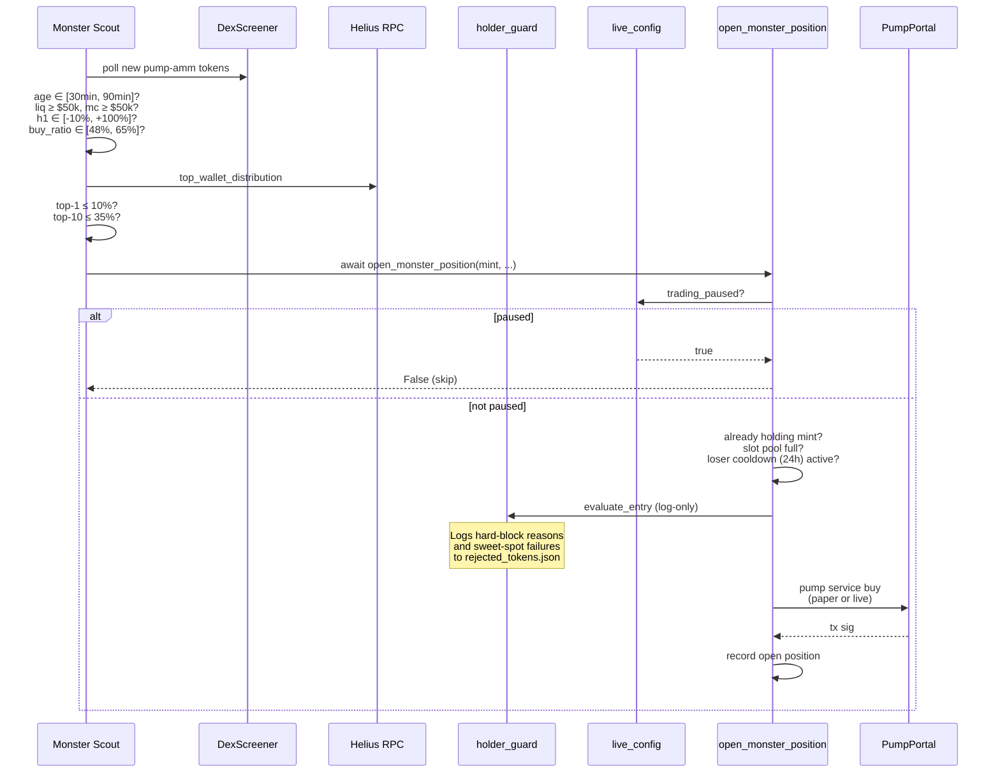
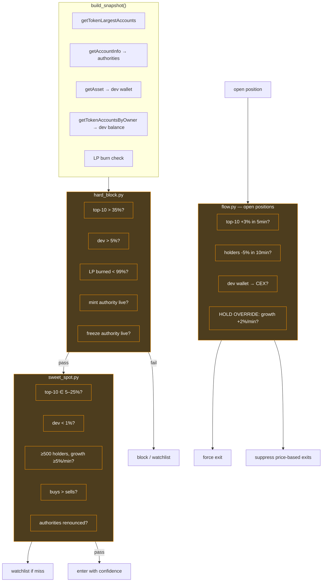
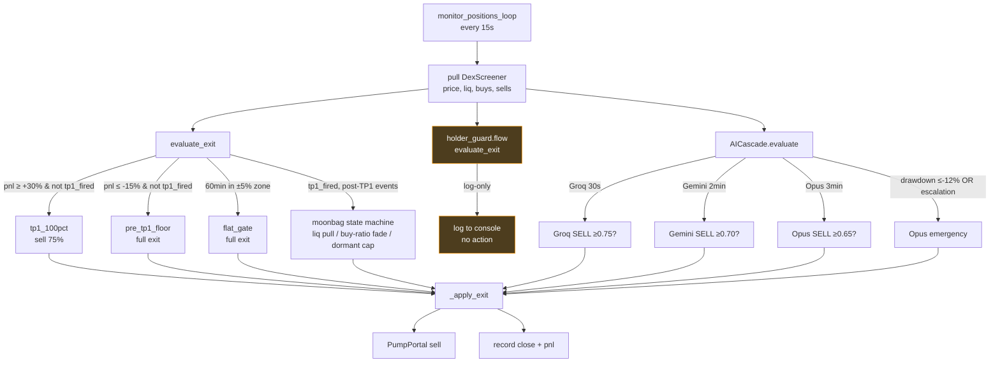
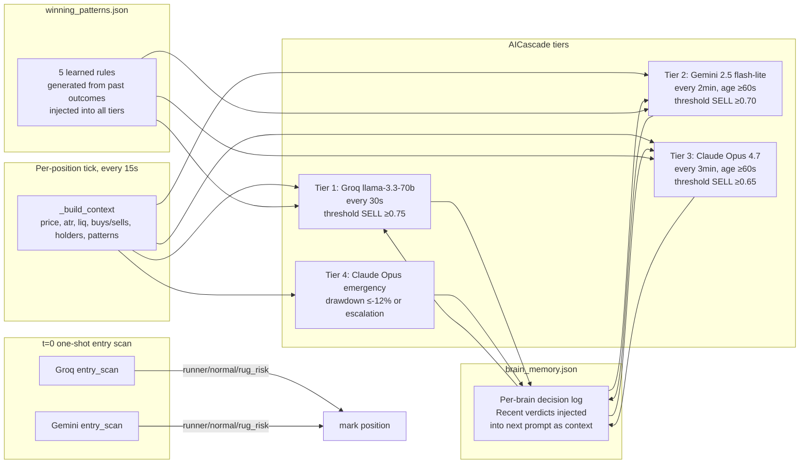
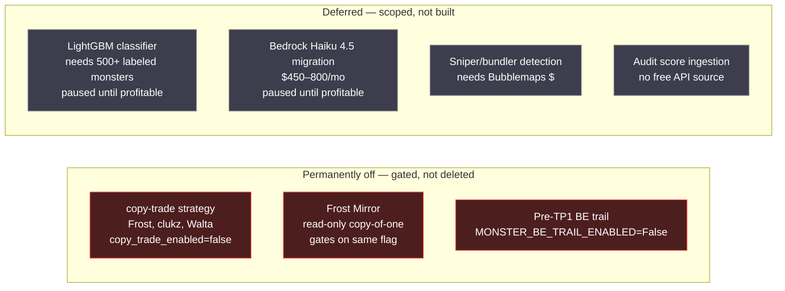

# TraderBot — Solana Monster-Strategy Architecture

_Last reviewed 2026-04-24. Monster-only era. Copy-trade permanently retired._

## The goal, in one sentence

Find Solana memecoins during the brief post-graduation window where they look like they could become monster runners (10x+ within hours), enter before the real pump, ride to a managed exit, and refuse everything that looks like a rug setup.

## Design principles

1. **Deterministic rules over LLM opinions on the hot path.** Entry filters and exit rules are plain Python thresholds. LLMs advise; they don't gate money-moving decisions. Research consensus (FINSABER, LLMTime, TABULA-8B) is clear: LLMs underperform gradient-boosted rules on numerical tabular data at our sample size.
2. **Defense in depth.** Multiple independent layers reject the same bad token. If one filter drifts, others catch it.
3. **Log-only before enforce.** New filters ship with logging-only behavior so we measure false-positive rate against the bot's actual data before trusting them.
4. **Reversible, not destroyed.** Dead code is gated with a flag (`copy_trade_enabled=false`, `MONSTER_BE_TRAIL_ENABLED=False`), not deleted. Changing our mind is one line.
5. **One pause button actually pauses everything.** Dashboard Pause sets `trading_paused=true` and every strategy checks it.

---

## High-level flow

```mermaid
flowchart LR
    subgraph Sources["Data Sources"]
        HEL[Helius RPC / LaserStream]
        DEX[DexScreener API]
        PP[PumpPortal API]
    end

    subgraph Scouts["Scout Layer — find candidates"]
        CL[cluster_confirm]
        SE[serial_deployer]
        LC[lifecycle]
        BR[breakout_candle]
    end

    subgraph Guards["Guard Layer — reject bad candidates"]
        DET[Deterministic rule filters<br/>top-1/top-10/h1/age/liq/mc]
        HG[holder_guard<br/>hard-block + sweet-spot<br/>currently log-only]
    end

    subgraph Exec["Execution"]
        OMP[open_monster_position]
        PP_BUY[PumpPortal buy tx]
        JITO[Jito block submit]
    end

    subgraph Mon["Position Monitoring"]
        EVAL[evaluate_exit]
        FLOW[holder_guard.flow<br/>log-only]
        AI[AICascade brains<br/>Groq / Gemini / Opus]
    end

    subgraph ExitLayer["Exits"]
        TP1[TP1 +30% → sell 75%]
        FLOOR[Pre-TP1 floor -15%]
        FLAT[60min flat gate]
        MOONBAG[Post-TP1 state machine]
    end

    HEL --> Scouts
    DEX --> Scouts
    Scouts --> Guards
    Guards --> OMP
    OMP --> PP_BUY --> JITO
    OMP --> Mon
    DEX --> Mon
    HEL --> Mon
    Mon --> ExitLayer
    ExitLayer --> PP_BUY

    classDef enforced fill:#1e4d2b,stroke:#4caf50,color:#fff
    classDef logonly fill:#4d3d1e,stroke:#ff9800,color:#fff
    classDef dead fill:#4d1e1e,stroke:#f44336,color:#fff
    class DET,TP1,FLOOR,FLAT,MOONBAG,OMP,PP_BUY,JITO enforced
    class HG,FLOW logonly
```



Green = enforcing. Orange = log-only (gathering data before enforce). Red (not shown) = gated off (copy-trade, Frost Mirror, pre-TP1 BE trail).

---

## Entry side — how a signal becomes a trade



---

## Scouts — the four signal sources

All four scouts feed the same choke point (`open_monster_position`). Each has a different hypothesis about what a future monster looks like.

| Scout | File | Hypothesis | Key filters |
|---|---|---|---|
| **cluster_confirm** | [monster_signals.py](monster_signals.py) `cluster_confirm_scout_loop` | 3+ known-alpha cluster wallets coincidentally buying the same new mint within 10min = insider convergence | cluster_wallets.json watchlist, 60min peak-ratio ≥ 0.85, liq ≥ $30k, top-10 ≤ 35% |
| **serial_deployer** | `serial_deployer_sniper_loop` | Creator has shipped prior monsters — if they ship a new one, follow | monster_creator_whitelist.json, waits up to 1h for graduation, top-1 ≤ 15%, top-10 ≤ 35% |
| **lifecycle** | `lifecycle_scout_loop` | Post-graduation token in the age/liq/mc/buy-ratio sweet spot where monster runs begin | age 30–90min, liq $50k–$1M, mc $50k–$5M, liq/mc ratio 4–15%, h1 ∈ [-10%, +100%], m5 ≤ +15%, top-1 ≤ 10%, top-10 ≤ 35%, socials required |
| **breakout_candle** | `breakout_candle_scout_loop` | +20% m5 breakout candle on a thin pump-amm pair with healthy buy-ratio | age 30min–12h, m5 ≥ +20%, liq $60k–$300k, h1 vol ≥ $3k, buy_ratio ≥ 65%, top-1 ≤ 12%, top-10 ≤ 35%, rugcheck pass |

**Rejection outcome loop**: every reject goes to [rejection_tracker.py](rejection_tracker.py) → 2h later, DexScreener outcome is checked → if the rejected token pumped ≥50%, filter flagged as "over-rejecting"; if rugged ≥50%, filter flagged as "saving us." Jarvis uses this to suggest threshold tunes.

---

## Holder Guard — the new defense-in-depth layer



**Mode**: `HOLDER_GUARD_ENFORCE=false` (log-only). Every would-be block writes to `rejected_tokens.json` with `reason=holder_guard_hard_block` and all the snapshot data. After 24–48h of live data, we compare blocked-and-pumped vs blocked-and-rugged to decide whether to flip enforcement.

**What's hand-seeded vs empty**:
- Top-10 concentration, dev %, LP burn, authority renunciation — all computed live via Helius RPC, no subscription needed beyond the existing Helius plan
- CEX registry — ~10 seed addresses for major exchanges in [holder_guard/cex_addresses.json](holder_guard/cex_addresses.json). Expand as needed.
- Snipers / bundlers / audit score / fresh-wallet % — fields exist on the snapshot but populate as `None`. Deferred until we subscribe to Bubblemaps / Nansen / audit feeds.

The scheduled 48h agent pulls `GET /api/holder-guard/report?hours=48` and emails you the FLIP / HOLD / INCONCLUSIVE verdict.

---

## Exit side — how a position closes



**Pre-TP1 protection layers (current state)**:

| Layer | Status | Threshold | Why |
|---|---|---|---|
| Hard floor | ✅ active | -15% | Catastrophic loss cap, unconditional |
| Flat gate | ✅ active | 60min in ±5% | Opportunity cost — dead money exit |
| **BE trail** | ❌ **disabled 2026-04-24** | (was peak +20% / pnl ≤+10%) | Was ejecting monster runners on natural pulse-and-breath pullbacks (AINI, SAM) |
| Brain cascade | ✅ active | Groq/Gemini/Opus tiers | Advisory exit on sharp breakdown reads |

**Post-TP1 (the moonbag rides)**: 25% of original position stays open. Exits event-driven:
- Liq drops > 40% in 5min → exit
- Buy-ratio < 30% sustained 10min → exit
- 8h dormant cap (don't hold forgotten bags)
- Brain SELL signals

---

## AI brain cascade — what the brains actually do



**Why tiered cadence**: Groq is fast + cheap, first line of defense on price breakdowns. Gemini adds independent second opinion. Opus 4.7 runs deep analysis including pattern memory from past trades. Emergency tier fires on catastrophic drawdown or when Groq+Gemini both escalate.

**Brains DON'T decide entries.** Entry is 100% deterministic: scout signal + filter gates + holder-guard (log-only). Brains only grade open positions.

**Honest note**: the brains have been demonstrably not the bottleneck for recent losses (AINI exited on deterministic BE trail; TRADE entered on deterministic lifecycle filter). The architecture above describes what they do; whether they're adding edge is a separate question being measured through rejection_tracker outcomes.

---

## What's NOT active (retired / gated)



---

## Dashboard / Jarvis / control plane

```mermaid
flowchart TB
    subgraph Browser["Dashboard (63.180.211.88:3001)"]
        JC[Jarvis chat]
        PP_BTN[Pause button]
        PANELS[Position + P&L panels]
    end

    subgraph API["dashboard_api.py (aiohttp)"]
        ST[/api/status]
        POS[/api/positions]
        HIST[/api/history]
        CHAT[/api/chat]
        PAUSE[/api/copy-trade/pause]
        HGR["/api/holder-guard/report"]
    end

    subgraph Jarvis["jarvis_command_centre.py"]
        ROUTER[command router]
        CONTEXT[context assembler]
        LLM[Claude Haiku / Sonnet / Opus]
    end

    subgraph State["Runtime state"]
        LC[live_config: JSON]
        MP[monster_positions.json]
        TH[trade_history.json]
        RT[rejected_tokens.json]
        BM[brain_memory.json]
    end

    Browser --> API
    CHAT --> ROUTER
    ROUTER --> CONTEXT
    CONTEXT --> LLM
    LLM --> CHAT
    PAUSE --> LC
    LC -->|trading_paused| Scouts
    LC -->|copy_trade_paused| CopyTrade
    HGR --> RT
    HGR --> MP
    API --> State
    CONTEXT --> State
```

**Pause semantics (fixed 2026-04-24)**: the button sets both `trading_paused` AND `copy_trade_paused`. Monster, copy-trade, and any future strategy all check `trading_paused`. Pre-fix, only copy-trade honored it — monster kept trading while dashboard said paused.

---

## Infrastructure

| Layer | Service | Notes |
|---|---|---|
| **Compute** | AWS EC2 Frankfurt | Elastic IP `63.180.211.88`. systemd unit `traderbot.service` auto-restarts. Frankfurt for Solana validator density + future Jito Block Engine locality. |
| **RPC** | Helius Business (`mainnet.helius-rpc.com`) | Paid. LaserStream gRPC for pump.fun txns in real-time. Multiple RPC calls per signal (getTokenLargestAccounts, getAccountInfo, getAsset). |
| **Market data** | DexScreener (free) | Per-token polling for price / liq / mc / volume / buys / sells. |
| **Execution** | PumpPortal (`pumpportal.fun/api/trade-local`) | Free. `priorityFee` doubles as Jito tip. Routes pump-curve, pump-amm, raydium. |
| **Brains** | Groq / Gemini / Anthropic APIs | Pay-per-call. Anthropic auto-refills when <$5 balance. Groq X.AI social discovery uses a separate account (currently out of credit). |
| **Dashboard** | aiohttp + React SPA | Single port 3001. Public HTTP (no TLS). |
| **Alerts** | Telegram bot | Entry / exit / circuit-breaker notifications. |
| **Persistence** | Flat JSON files under `solana/` | `trade_history`, `monster_positions`, `brain_memory`, `rejected_tokens`, `live_config`, `cooldowns`, etc. Hot-reloaded where relevant. No database. |

---

## Current enforcement snapshot

| Protection | File | Enforcing? | Threshold |
|---|---|---|---|
| Pause (all strategies) | [strategy_e_monster.py:146](strategy_e_monster.py#L146), [live_config.py:164](live_config.py#L164) | ✅ | `trading_paused` |
| Lifecycle h1 downside floor | [monster_signals.py:745](monster_signals.py#L745) | ✅ | `h1_change ≥ -10%` |
| Top-10 cap, all scouts | [monster_signals.py:102](monster_signals.py#L102) | ✅ | `top_10_pct ≤ 35%` |
| Top-1 caps, per-scout | various | ✅ | 10 / 12 / 15 |
| Pre-TP1 hard floor | [strategy_e_monster.py:37](strategy_e_monster.py#L37) | ✅ | `-15%` |
| Flat gate | [strategy_e_monster.py:43](strategy_e_monster.py#L43) | ✅ | 60min in ±5% |
| Pre-TP1 BE trail | [strategy_e_monster.py:43](strategy_e_monster.py#L43) | ❌ **disabled** | flag off since 2026-04-24 |
| TP1 | [strategy_e_monster.py:35](strategy_e_monster.py#L35) | ✅ | +30% → sell 75% |
| Post-TP1 moonbag state machine | [strategy_e_monster.py:394](strategy_e_monster.py#L394) | ✅ | event-driven |
| AI cascade exit advisories | [trade_monitor.py:511](trade_monitor.py#L511) | ✅ | per-tier confidence thresholds |
| holder_guard hard-block | [holder_guard/hard_block.py](holder_guard/hard_block.py) | ⚠️ **log-only** | flip via `HOLDER_GUARD_ENFORCE=true` |
| holder_guard sweet-spot | [holder_guard/sweet_spot.py](holder_guard/sweet_spot.py) | ⚠️ **log-only** | same flag |
| holder_guard flow exits | [holder_guard/flow.py](holder_guard/flow.py) | ⚠️ **log-only** | same flag |
| CEX auto-exit | [holder_guard/cex_registry.py](holder_guard/cex_registry.py) | ⚠️ **log-only** | same flag |
| Copy-trade strategy | [axiom_copy_trader.py](axiom_copy_trader.py) | ❌ **gated off** | `copy_trade_enabled=false` |
| Frost Mirror | [axiom_copy_trader.py:597](axiom_copy_trader.py#L597) | ❌ **gated off** | same flag |

---

## The near-term roadmap (no new spend)

1. **48h log-only window** — let holder_guard observe live signals. Scheduled agent (`trig_01TuBq9ydbdX4frgXB3YAmFi`) emails the verdict Sunday 12:30 Dublin.
2. **Flip enforcement IF** false-positive rate is below 15% of holder_guard hard-blocks subsequently pumping ≥50%.
3. **Tune thresholds IF** the log-only window shows over-rejection. Only the thresholds — not the architecture.
4. **Expand CEX registry** from 10 → 50 seed addresses via Solscan labels. Zero code change, just [cex_addresses.json](holder_guard/cex_addresses.json) edits.

## Deferred until the bot is profitable

- **LightGBM classifier** on 50 holder/flow features ([PDF research](/dev/null) — it's the right path when the dataset supports it).
- **Bedrock Haiku 4.5 EU CRIS migration** — ~10× cheaper than Opus hot-path with prompt caching. Estimated $450–800/mo at your current volume.
- **Bubblemaps / Nansen** — unlocks sniper / bundler / smart-money-overlap filters that are currently `None` on the snapshot.

---

## If you're reading this cold

The bot's purpose is simple. The implementation is layered because we've learned (painfully) that no single filter catches every failure mode, and no single model decides trades well. The combination — deterministic scout filters → deterministic guards → paid LLM advisory → deterministic exits — is the architecture. The rest is tuning.
